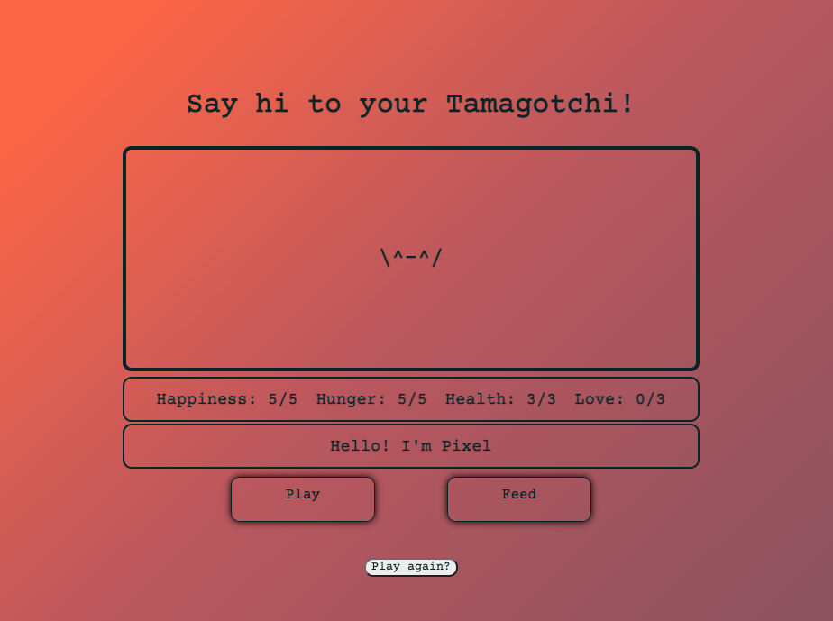

# Tamagotchi

## Description
 This is a version of the once-popular handheld game **Tamagotchi.** In it, you care for a creature named Pixel by feeding and playing with them to keep their hunger and happiness meters high. If you care for them long enough, they will grow to love you and you will 'win' the game. If you do not take care of them and their health drops to 0, they will die and the game will end.

## Screenshot

 

## Technologies used

HTML, CSS, JavaScript.

## Getting started

Below find the link to the game. The game will begin automatically 7 seconds after opening.

https://echoesong.github.io/Tamagotchi/

## Future goals

- Based on feedback, rework CSS. Update to be mobile friendly, change color scheme to be more visually legible

- On game start, Tamagotchi provided to player is one of a variety that could be generated. Each would have different stats (i.e., one would lose hunger quickly because they're a fatty)

- Add a simple game you can play with your Tamagotchi (gameception!)

- Theme the game around something other than Tamagotchi 

